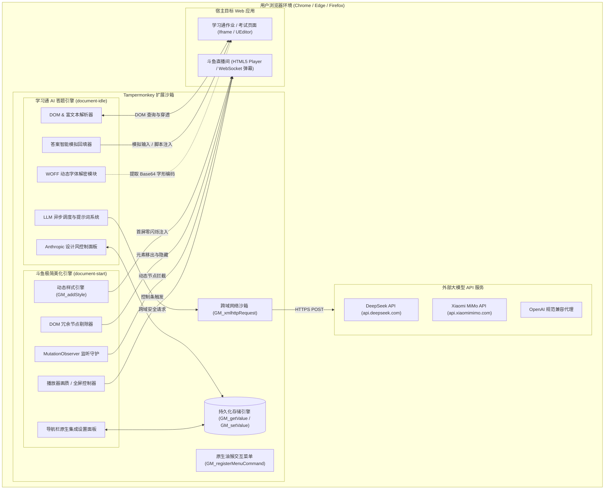
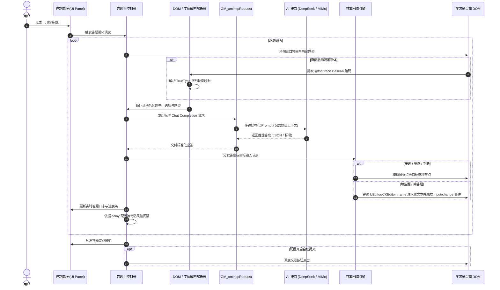
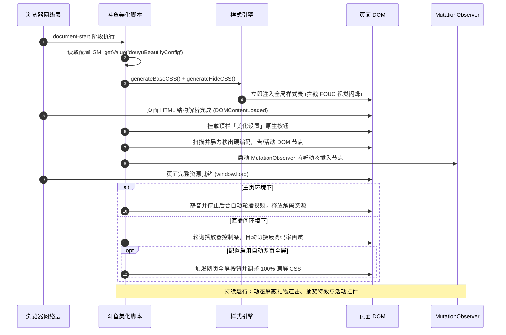

# Tampermonkey 脚本合集 (Tampermonkey Scripts)

[](https://www.tampermonkey.net/)
[](https://developer.mozilla.org/zh-CN/docs/Web/JavaScript)
[](LICENSE)
[](https://github.com/e69d8e/tampermonkey-scripts)

一组面向现代 Web 应用的高性能、轻量化 Tampermonkey（油猴）用户脚本合集。每个脚本均采用自包含单文件 IIFE 架构，无外部构建依赖，安装即用，针对目标平台的 DOM 结构与网络行为提供细粒度优化与智能化自动化支持。

---

## 脚本矩阵

> [!IMPORTANT]
> **⚡ 一键安装前置条件**：
> 油猴脚本（`.user.js`）无法在裸浏览器中直接运行。在点击下方「一键安装」链接前，**必须先在浏览器中安装并启用脚本管理器扩展（[篡改猴 Tampermonkey](https://www.tampermonkey.net/) 或 [脚本猫 ScriptCat](https://scriptcat.org/) 二选一）**。
> - **已安装扩展**：点击下方链接，扩展会自动拦截并弹出脚本安装确认窗口，点击“安装”即可。
> - **未安装扩展**：点击链接将只显示纯文本代码或直接下载文件。请先前往下方 [前置管理器安装教程](#1-前置运行环境准备已装扩展可跳过) 安装扩展。

| 脚本工程 | 版本 | 目标平台匹配 | 核心特性 | 一键安装 (需已装扩展) | 详细教程 |
|---|:---:|---|---|:---:|:---:|
| **[学习通AI自动答题](./automatic-AI-answer-system-for-xxt)** | `0.0.1` | `*://*.chaoxing.com/*`<br>`*://*.edu.cn/*` | • WOFF 动态字体解密<br>• 单选/多选/判断/填空/简答全题型支持<br>• 富文本 iframe / UEditor 自动回填<br>• DeepSeek & MiMo 双驱动 / 自定义端点 | [⚡ 一键安装](https://github.com/e69d8e/tampermonkey-scripts/raw/main/automatic-AI-answer-system-for-xxt/%E5%AD%A6%E4%B9%A0%E9%80%9AAI%E7%AD%94%E9%A2%98.user.js) | [使用教程](./automatic-AI-answer-system-for-xxt/README.md) |
| **[斗鱼直播美化](./douyu-beautification)** | `0.0.1` | `*://www.douyu.com/*`<br>`*://douyu.com/*` | • `document-start` 零闪烁 CSS 注入<br>• 10 项全方位界面冗余元素净化<br>• 16:9 居中自适应大窗 / 100% 满屏<br>• 顶栏即时设置面板 & 实时热切换 | [⚡ 一键安装](https://github.com/e69d8e/tampermonkey-scripts/raw/main/douyu-beautification/douyu-beautification.user.js) | [使用教程](./douyu-beautification/README.md) |


---

## 整体架构设计

仓库遵循 **独立单文件自包含 (Self-Contained Monorepo)** 架构哲学。每个脚本自闭环运行于 Tampermonkey 的隔离沙箱与上下文环境内，通过标准 `GM_*` API 与目标页面 DOM 进行受控交互。



---

## 核心业务时序图

### 1. 学习通 AI 自动答题工作流



### 2. 斗鱼直播间净化与性能调优生命周期



---

## 技术栈与权限清单

### 技术栈规范
- **运行环境**：Tampermonkey v4.18+ / Violentmonkey / ScriptCat
- **语言标准**：原生 Vanilla JavaScript (ECMAScript 2020+)
- **界面体系**：原生 Web Components 理念封装，CSS 采用 CSS 变量与现代 Flexbox/Grid 布局，无第三方面板依赖
- **安全与跨域**：利用 Tampermonkey 高特权网络沙箱 `GM_xmlhttpRequest` 绕过 CORS 策略

### 油猴 API 特权清单

| API 标识 | 授权脚本 | 权限说明与设计考量 |
|---|:---:|---|
| `GM_addStyle` | 两者兼备 | 注入首屏样式表，支持即时动态样式热覆盖，避免因页面脚本执行延迟导致的界面闪烁 (FOUC) |
| `GM_getValue` | 两者兼备 | 读取用户本地个性化持久配置，确保跨页面和刷新后设置不丢失 |
| `GM_setValue` | 两者兼备 | 将用户面板中的最新修改实时写入油猴本地沙箱数据库 |
| `GM_registerMenuCommand` | 两者兼备 | 在浏览器扩展工具栏右键菜单注册脚本交互快捷入口 |
| `GM_xmlhttpRequest` | 学习通AI | 允许直接向 `api.deepseek.com` 与 `api.xiaomimimo.com` 发起跨域 HTTPS 请求，免除中间转发代理 |
| `unsafeWindow` | 学习通AI | 访问并修补宿主页面全局对象（用于拦截学习通编辑器内部崩溃错误 `loadEditorAnswerd`） |

---

## 数据模型与配置规范

脚本配置持久化存储于 Tampermonkey 的隔离 Storage 中，采用以下结构定义：

### 1. 学习通 AI 答题配置模型 (`CONFIG`)

| 配置项 (Key) | 类型 | 默认值 | 描述 |
|---|:---:|:---:|---|
| `provider` | `string` | `'deepseek'` | 当前激活的 AI 提供商，可选值：`deepseek`、`mimo` |
| `deepseekKey` | `string` | `''` | DeepSeek 平台 API 密钥 (`sk-...`) |
| `mimoKey` | `string` | `''` | Xiaomi MiMo 平台 API 密钥 (`sk-...`) |
| `customEndpoint` | `string` | `''` | 自定义 OpenAI 兼容格式服务地址（如第三方中转代理） |
| `deepseekModel` | `string` | `'deepseek-v4-pro'` | DeepSeek 服务端模型代号 |
| `mimoModel` | `string` | `'mimo-v2.5-pro'` | MiMo 服务端模型代号 |
| `delay` | `number` | `2000` | 逐题执行间隔延迟（单位：毫秒），模拟人类做题节奏 |
| `autoSubmit` | `boolean` | `false` | 全部题目自动答完后是否直接提交试卷 |

### 2. 斗鱼直播美化配置模型 (`douyuBeautifyConfig`)

```typescript
interface DouyuBeautifyConfig {
    removeHeader: boolean;      // 精简顶部导航栏（仅留核心功能）
    removeAside: boolean;       // 移除右侧边栏（弹幕与聊天列表）
    removeGiftBar: boolean;     // 移除底部礼物栏及送礼特效区
    removeFooter: boolean;      // 移除网站底部说明及页脚
    removeAds: boolean;         // 移除直播间内嵌横幅广告
    removeWatermark: boolean;   // 移除播放器画面水印
    removeActivity: boolean;    // 移除活动、任务弹窗及活动皮肤背景
    removeSideBanner: boolean;  // 移除侧边工具条与活动挂件
    removeRecommend: boolean;   // 移除视频下方推荐条及互动卡片
    removeTopBar: boolean;      // 精简主播信息栏（勋章/贵族标签等）
    autoWebFullscreen: boolean; // 进入直播间自动开启网页全屏
    autoHighQuality: boolean;   // 进入直播间自动选择最高清晰度
    darkMode: boolean;          // 强制启用沉浸式暗黑底色
    showChatPanel: boolean;     // 保留右侧聊天区（优先级高于 removeAside）
    playerExpand: boolean;      // 播放器扩展：标准 16:9 自适应居中，全屏 100% 铺满
}
```

---

## 工程目录结构

```
tampermonkey-scripts/
├── .gitignore                                      # Git 忽略配置
├── CLAUDE.md                                       # 开发架构规约与指引
├── README.md                                       # 项目技术全景文档
├── automatic-AI-answer-system-for-xxt/             # 【项目一】学习通 AI 自动答题系统
│   ├── 学习通AI答题.user.js                          # 脚本单文件源码（IIFE）
│   ├── DESIGN.md                                   # Anthropic UI 规范与 Design Tokens
│   └── README.md                                   # 用户操作手册与故障排除指南
└── douyu-beautification/                           # 【项目二】斗鱼直播间极致美化
    ├── douyu-beautification.user.js                # 脚本单文件源码（IIFE）
    ├── CLAUDE.md                                   # 模块专用架构规约
    └── README.md                                   # 选项功能清单与更新记录
```

---

## 环境搭建与安装指南

### 1. 前置运行环境准备（已装扩展可跳过）

用户脚本（`.user.js`）无法独立运行，必须依托浏览器中的脚本管理器。推荐以下两款主流扩展（**二选一安装即可**）：

| 脚本管理器 | 特点与推荐场景 | 官方下载 / 安装商店链接 |
|---|---|---|
| **篡改猴 (Tampermonkey)** | 全球使用量最大的老牌油猴扩展，兼容性强、功能成熟 | [官网入口](https://www.tampermonkey.net/)<br>• [Edge 商店 (推荐)](https://microsoftedge.microsoft.com/addons/detail/tampermonkey/iikmkjmpaadaobahmlepeloendndfphd)<br>• [Chrome Web Store](https://chromewebstore.google.com/detail/tampermonkey/dhdgffkkebhmkfjojejmpbldmpobfkfo)<br>• [Firefox 附加组件](https://addons.mozilla.org/firefox/addon/tampermonkey/) |
| **脚本猫 (ScriptCat)** | 国内开源优秀现代脚本管理器，无需特殊网络访问，对国内平台优化好 | [官网入口](https://scriptcat.org/)<br>• [Edge 商店 (推荐)](https://microsoftedge.microsoft.com/addons/detail/%E8%84%9A%E6%9C%AC%E7%8C%AB/liilgpjgabokdklappibcjfablkpcekh)<br>• [Chrome Web Store](https://chromewebstore.google.com/detail/%E8%84%9A%E6%9C%AC%E7%8C%AB/ndjpnnhakmfoccggihnmidhidhkgkien)<br>• [Firefox 附加组件](https://addons.mozilla.org/zh-CN/firefox/addon/scriptcat/) |

> 📌 **建议**：安装扩展后，请在浏览器工具栏将「篡改猴」或「脚本猫」图标点击图钉固定，确保扩展处于已启用状态。

---

### 2. 脚本一键自动安装（最推荐 ⚡）

当您的浏览器已安装上述任一扩展后，直接点击下方对应脚本链接。扩展将自动拦截请求并唤起安装审查界面，点击 **“安装”**（若已安装则为“更新”）即可一键就绪：

- 📦 **[一键安装《学习通AI自动答题》](https://github.com/e69d8e/tampermonkey-scripts/raw/main/automatic-AI-answer-system-for-xxt/%E5%AD%A6%E4%B9%A0%E9%80%9AAI%E7%AD%94%E9%A2%98.user.js)**
- 📦 **[一键安装《斗鱼直播美化》](https://github.com/e69d8e/tampermonkey-scripts/raw/main/douyu-beautification/douyu-beautification.user.js)**

---

### 3. 手动导入安装方式（网络受限备用）

若因网络原因无法通过链接自动唤起安装界面，可采用离线导入：
1. 在仓库对应目录下载 `*.user.js` 脚本文件保存到本地。
2. 点击浏览器右上角管理器图标，进入 **管理面板** -> **实用工具**。
3. 找到 **“从文件导入”** 区域，将下载的 `.user.js` 脚本直接拖入虚线框，点击确认导入。

---

## 本地开发与调试流程

本项目坚持极简主义，无需任何 `npm install` 或复杂的打包编译管线：

1. **直接编辑**：使用 VSCode、WebStorm 或任意编辑器直接修改 `*.user.js` 单文件。
2. **免手动同步开发方式**（推荐）：
   - 在 Tampermonkey 设置中，将「通用」->「配置模式」修改为「高级」。
   - 打开「允许访问文件网址」权限（Chrome 扩展设置页面）。
   - 在油猴中新建脚本，仅编写：
     ```javascript
     // ==UserScript==
     // @name         Local Dev
     // @match        *://*/*
     // @require      file:///path/to/tampermonkey-scripts/douyu-beautification/douyu-beautification.user.js
     // ==/UserScript==
     ```
   - 本地保存代码后直接刷新目标网页即可验证修改。

---

## 安全与隐私声明

1. **凭证安全性**：所有配置项（包括 AI 的 API Key）仅保存在用户浏览器的 Tampermonkey 本地隔离空间 (`GM_setValue`) 中，绝不向任何第三方中转服务器上传或泄露密钥。
2. **网络通信透明**：所有网络通信仅在用户触发答题时定向发往官方模型服务节点（DeepSeek / MiMo 官方域名）或用户手动指定的自定义端点。
3. **免责声明**：脚本仅用于前端工程架构探索、DOM 逆向技术学习与无障碍浏览优化，使用者应对其在特定平台的使用行为与合规性自行负责。

