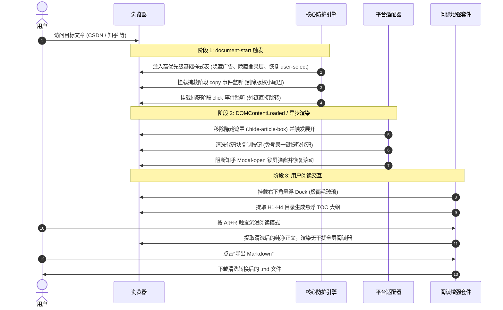

# 纯净阅读 (PureReader) — 多平台免登录去广告与沉浸阅读增强

专为 **CSDN、知乎、掘金、简书、博客园、微信公众号** 等主流中文技术与内容平台量身打造的极简、轻量、高颜值纯净阅读增强用户脚本。

核心攻克“强制未登录弹窗阻断阅读”、“各类营销推广横幅喧宾夺主”、“禁止复制与版权小尾巴劫持”、“外链繁琐安全中转”等核心痛点，并提供智能悬浮大纲 (TOC)、4 种护眼主题的沉浸阅读模式 (Zen Mode) 以及一键导出 Markdown / PDF 的完整阅读套件。

---

## 整体架构设计

脚本遵循自包含单文件 IIFE 架构，无外部构建依赖，在 `document-start` 阶段前置切入渲染流程，保障零样式闪烁（Zero FOUC）。

```mermaid
flowchart TB
    subgraph Browser["浏览器运行环境 (Chrome / Edge / Safari / Firefox)"]
        subgraph TM["Tampermonkey 沙箱环境 (pure-reader.user.js)"]
            direction TB
            
            subgraph CoreEngine["底层核心防护引擎 (document-start)"]
                CSS_INJECT["动态样式注入器 (GM_addStyle)"]
                COPY_GUARD["剪贴板防劫持与复制解禁器 (Clipboard API)"]
                LINK_GUARD["外链直达跳转器 (URL Rewrite & Click Capture)"]
                CONFIG_MGR["配置管理与持久化 (GM_getValue / GM_setValue)"]
            end

            subgraph Adapters["多平台适配器矩阵 (Platform Adapters)"]
                ADP_CSDN["CSDN 适配器<br>(免登录全文/防弹窗/代码免登录复制)"]
                ADP_ZHIHU["知乎 适配器<br>(锁屏弹窗熔断/去盐选广告/居中排版)"]
                ADP_JUEJIN["掘金 适配器<br>(去APP引导/精简右侧推广)"]
                ADP_JIANSHU["简书 适配器<br>(去底部唤端/展开全文)"]
                ADP_CNBLOGS["博客园 适配器<br>(去横幅广告/聚焦正文)"]
                ADP_WEIXIN["微信公众号 适配器<br>(桌面端宽屏/去二维码)"]
            end

            subgraph ReadingSuite["高级阅读套件 (Reading Suite)"]
                TOC_CTRL["智能悬浮大纲控制器 (Floating TOC)"]
                ZEN_MODE["沉浸极简阅读器 (4 种护眼色彩方案)"]
                EXPORTER["知识导出引擎 (Markdown / Print PDF)"]
                DOCK_UI["Anthropic 设计风悬浮工具坞 & 设置面板"]
            end

            CoreEngine --> Adapters
            Adapters --> ReadingSuite
        end

        subgraph TargetPages["宿主目标站点"]
            P_CSDN["CSDN 博客 / 文档"]
            P_ZHIHU["知乎 问答 / 专栏"]
            P_OTHERS["掘金 / 简书 / 博客园 / 微信公众号"]
        end

        ReadingSuite -.-> TargetPages
    end
```

---

## 核心时序图：拦截与净化流程

---

## 平台适配矩阵

| 目标平台 | 匹配域名 | 核心适配特性 |
|---|---|---|
| **CSDN** | `*://*.csdn.net/*` | • **宽屏大视野自适应加宽**：正文主区域拓宽至 `1200px`，彻底解决长代码横向挤压与阅读局促感 • **彻底根治强制跳转登录页**：清除 `.btn-readmore.click()` 陷阱与多层付费遮罩，前置桩化 `window.csdn.loginBox` 与 `userLogin`，拦截强制跳转 `passport.csdn.net` • 自动展开全文，移除“关注博主阅读全文”与 VIP 付费墙遮罩 (`.simple-vip-paywall, .vip-mask`) • 净化并移除固定在顶部的吸顶导航栏 (`#csdn-toolbar`) 与会员礼包入口 • 拦截未登录登录弹窗 (`passport-login-container`) 与全局锁屏 • 代码块免登录一键复制，彻底拦截“用码道免费领 Token / AI写代码”等代码块营销广告与展开遮罩 • 移除右侧侧边栏、底部博文推荐、悬浮工具栏、各类商业广告 |
| **知乎** | `*://*.zhihu.com/*` | • **宽屏大视野排版 (1060px)**：突破知乎专栏 `.Post-NormalMain`、`.Post-content` 原生硬编码 `690px` 锁死上限，突破知乎问答 `.Question-main`、`.Topstory-container` 原生 `1000px` 宽度夹持，主栏与版芯全面加宽至 `1060px` 居中舒适排布 • 拦截未登录滚动时触发的强制登录全屏弹窗 (`Modal-open`) 并恢复正常滚动 • 净化问答页吸顶导航栏 (`.AppHeader`)，享受纯净无干扰视野 • 自动展开折叠的回答与专栏文章 • 屏蔽知乎盐选专栏、知乎热榜侧边栏、商业推广卡片 |
| **掘金** | `*://juejin.cn/*` | • **大视野排版 (1050px)**：突破主栏 `.main-area.article-area` 锁死的 `width: 820px` 与外层 `.view.column-view` 的 Flex 约束，注入 `flex: 1 1 auto` 并拓展至 `1050px`，父容器扩至 `1120px` 居中对齐 • 隐藏顶部吸顶导航栏 (`header.main-header`) 与右下角悬浮面板 (`.suspension-panel`) • 严格样式隔离与盒模型重置，杜绝宿主 button CSS 污染导致控件变形与错位 • 移除右侧推荐栏、下载掘金 APP 悬浮窗、底部登录横条 |
| **简书** | `*://*.jianshu.com/*` | • **排版加宽 (1000px)**：精准穿透定位核心文章容器 `article._2rhmJa` 及多层父容器 `div._3VRLsv, div._gp-ck, section.ouvJEz`，彻底粉碎 `730px` 狭窄排版上限，自适应展开至 `1000px` • 隐藏顶部导航栏 (`nav.navbar`)，重置正文顶部间距 • 自动展开折叠文章 • 拦截底部“打开 APP 查看全部”引导横条与广告 |
| **博客园** | `*://*.cnblogs.com/*` | • **宽屏舒适视野 (1140px)**：突破 Flex 容器 `#main` 的原生 `flex-basis: 880px` 挤压，重置为 `flex: 1 1 auto`，隐藏侧边栏并将 `#mainContent` 释放拓宽至 `1140px` • 移除官方吸顶顶部栏 (`#top_nav`) 与博主自定义大头图横幅 (`#header`/`#blogHeader`) • 移除顶部、侧边及正文下方的全部广告位（c1/c2/b1/b2/ad_t2 等） • 隐藏冗余侧边组件，聚焦博客正文 |
| **微信公众号** | `*://mp.weixin.qq.com/*` | • **桌面端加宽 (980px)**：强制重写官方桌面端内嵌的 `.rich_media_area_primary { max-width: 677px !important }` 锁死上限，连带放开 `.rich_media_area_primary_inner` 与 `#img-content` 至 `980px` • 移除桌面端文章侧边扫码登录提示二维码与多余导流组件 • 解除文本长按与拖拽选中限制，提升宽屏阅读舒适度 |

---

## 高级阅读套件特性

### 1. 沉浸式极简阅读模式 (Zen Mode)
- **全局快捷键**：`Alt + R`（或点击悬浮 Dock 首个图标）随时开启/退出。
- **4 种精选调色板**：
  - **暖色羊皮纸 (Warm Canvas)**：底色 `#fbf9f4`，文字 `#2d2b28`，降低高光刺激，适合长时间长文阅读。
  - **清新护眼绿 (Eye-Care)**：底色 `#edf5ec`，文字 `#243324`，柔和舒适。
  - **纯白极简 (Clean White)**：底色 `#ffffff`，文字 `#1a1a1a`，对标电子墨水屏。
  - **深邃夜间黑 (Dark Night)**：底色 `#161615`，文字 `#dcdad5`，夜间深色不刺眼。
- **排版微调**：支持 `A-` / `A+` 实时字号缩放（14px - 26px）、版芯宽度调节（860px / 1000px / 1180px 循环切换，默认 1000px 大版芯）。

### 2. 悬浮智能大纲 (Floating TOC)
- **全局快捷键**：`Alt + T`（或点击悬浮 Dock 第二个图标）快速展开/折叠。
- **层级感知**：自动解析文章内部 `H1-H4` 标题，构建阶梯缩进目录树。
- **实时跟踪**：监听页面滚动位置，自动高亮当前阅读小节，点击平滑平移至目标锚点。

### 3. 本地知识归档导出
- **导出 Markdown**：内建轻量 AST 节点转换器，将标题、段落、粗体、斜体、列表、引用块、图片以及**带语法高亮标签的代码块**标准化输出为 `.md` 文件。
- **打印 / 导出 PDF**：自动挂载 `@media print` 净化样式，屏蔽网页无用按钮与背景噪点，一键唤起系统打印对话框存为矢量 PDF。

### 4. 剪贴板净化与外链直达
- **版权小尾巴清洗**：彻底屏蔽类似 `“作者：xxx 链接：https://... 来源：知乎 著作权归作者所有...”` 以及 CSDN 的版权说明后缀。
- **外链中转绕过**：直接跳过 `link.zhihu.com`、`link.csdn.net`、`link.juejin.cn` 等平台的中转跳转确认页，直达目标站点。

---

## 数据模型与配置清单

所有配置均由 `GM_getValue` / `GM_setValue` 引擎在沙箱内持久化保存：

| 配置键名 (`Key`) | 类型 | 默认值 | 功能释义 |
|---|:---:|:---:|---|
| `unblockCopy` | `boolean` | `true` | 解除防复制限制与自动清洗版权小尾巴 |
| `bypassRedirect` | `boolean` | `true` | 外链直接跳转（绕过中转页） |
| `removeAds` | `boolean` | `true` | 拦截广告、营销横幅与浮动挂件 |
| `autoExpandContent` | `boolean` | `true` | 自动展开全文/阅读全文 |
| `blockLoginModal` | `boolean` | `true` | 拦截未登录阻断弹窗与强制锁屏 |
| `enableFloatingTOC` | `boolean` | `true` | 启用智能悬浮文章大纲目录 |
| `enableZenMode` | `boolean` | `true` | 启用沉浸式极简阅读器 |
| `enableCodeCopy` | `boolean` | `true` | 代码块免登录一键复制增强 |
| `hideTopNav` | `boolean` | `true` | 净化/隐藏各平台顶部导航栏与大头图横幅 (CSDN/掘金/博客园/简书等) |
| `wideArticleLayout` | `boolean` | `true` | **宽屏大视野排版**：将各平台正文及版芯自适应拓宽至 1000~1200px |
| `zenTheme` | `string` | `'cream'` | 阅读模式主题（`cream` / `green` / `dark` / `white`） |
| `zenFontSize` | `number` | `17` | 阅读模式基准字号 (px) |
| `zenMaxWidth` | `number` | `1000` | 阅读模式最大版芯宽度 (px) |
| `showFloatingDock` | `boolean` | `true` | 显示右下角轻量悬浮工具坞 |

---

## 安装使用指南

### 1. 前置条件准备（二选一）

油猴脚本必须在具有用户脚本扩展的浏览器环境中运行：
- **方案 A（国内网络推荐）：脚本猫 (ScriptCat)** 👉 [脚本猫官网](https://scriptcat.org/)
- **方案 B（全球老牌主流）：篡改猴 (Tampermonkey)** 👉 [Tampermonkey 官网](https://www.tampermonkey.net/)

### 2. 一键快速安装

确保浏览器中已开启扩展，直接点击下方官方源链接：

👉 [⚡ 点击一键安装《纯净阅读 (PureReader)》脚本](https://github.com/e69d8e/tampermonkey-scripts/raw/main/pure-reader/pure-reader.user.js)

浏览器扩展会自动识别并弹出安装面板，点击 **“安装”** 即可。

### 3. 手动导入安装

若网络环境无法直接访问 Raw 链接：
1. 下载本仓库项目中的 [`pure-reader.user.js`](./pure-reader.user.js) 文件。
2. 打开 Tampermonkey 管理面板 → 顶部点击「实用工具」标签页。
3. 将下载的 `.user.js` 文件拖拽至「从文件导入」虚线区域，点击确认导入。

---

## 快捷键速查

| 快捷键 | 功能动作 |
|:---:|---|
| <kbd>Alt</kbd> + <kbd>R</kbd> | 开启 / 退出沉浸式阅读模式 (Zen Mode) |
| <kbd>Alt</kbd> + <kbd>T</kbd> | 展开 / 收起文章悬浮大纲目录 (Floating TOC) |
| <kbd>Esc</kbd> | 退出沉浸式阅读视图 |
